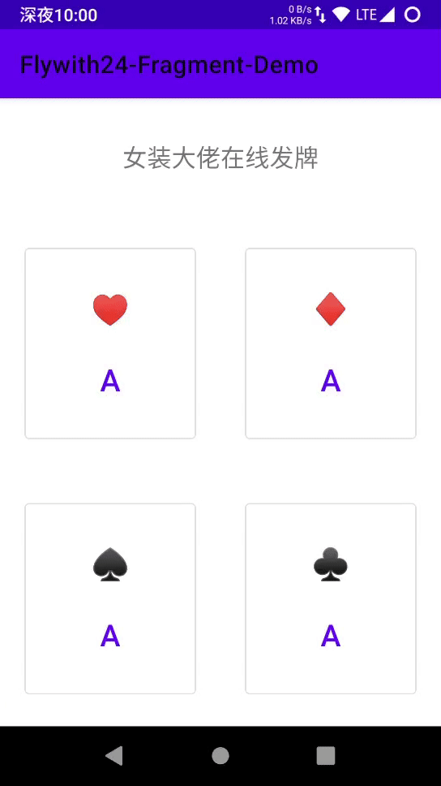
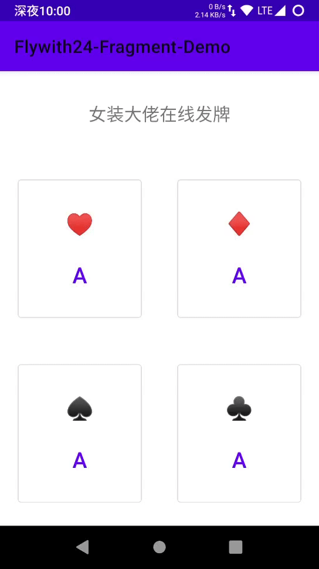
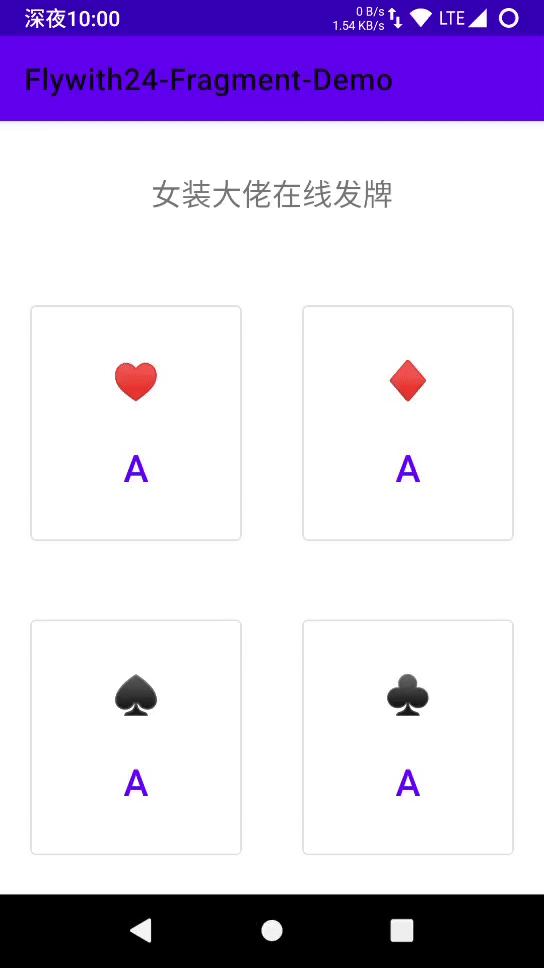

##  fragment demo

> `demo_` 前缀的为project，即单独 app

 

| module | 描述                |
|----------------------|-----------------------------|
| demo\_backstack      | fragment 返回栈（包括单返回栈和多返回栈）      |
| demo\_databinding      | databinding demo      |
| demo\_lifecycle      | lifecycle demo      |
| demo\_livedata       | livedata demo      |
| demo\_livedata\_vs\_flow     | livedata\_vs\_flow demo |
| demo\_concatadapter   | 更优雅地为 RecyclerView 添加 Header Footer     |
| demo\_paging         | paging demo,仅网络和网络+数据库 两种方式     |
| demo\_recyclerview_scroll         | 恢复 RecyclerView 滚动状态    |
| demo\_resultapi      | Fragment result API，Fragment 间通信新方式 |
| demo\_savestate      | viewmodel-savedstate实践 fragment replace 状态恢复测试 |
| demo\_singlefragment | 最简单的场景生命周期分析                |
| demo\_viewmodel      | viewmodel demo      |
| demo\_viewpager2     | fragment \+ viewpager2 demo |

## blog

- [【背上Jetpack】你真的会用Fragment吗？Fragment常见问题以及androidx下Fragment的使用新姿势](https://juejin.im/post/5e5cd8686fb9a07cbc269d10)

- [【背上Jetpack】从源码角度看Fragment的启动流程及生命周期 基于AndroidX Fragment1.2.2](https://juejin.im/post/5e67523551882549003d2c4f)

- [【背上Jetpack】从源码的角度看Fragment 返回栈 附多返回栈demo](https://juejin.im/post/5e6e50a3518825490762098b)

- [【背上Jetpack】绝不丢失的状态 androidx SaveState ViewModel-SaveState 分析](https://juejin.im/post/5e738d12518825495d69cfb9)

- [【背上Jetpack之ViewModel】即使您不使用MVVM也要了解ViewModel ——ViewModel 的职能边界](https://juejin.im/post/5e786d415188255e00661a4e) 

- [【背上Jetpack之Lifecycle】万物基于Lifecycle](https://juejin.im/post/5e8348bef265da47e02a6ce2)

- [【背上Jetpack之LiveData】ViewModel 的左膀右臂 数据驱动真的香](https://juejin.im/post/5e834bb5f265da480d61668d)

- [【背上Jetpack之DataBinding】数据驱动魔法师 何时迎来翻身日？](https://juejin.im/post/5e8ef0bc518825736b749705)

- [【Jetpack 更新之 RecyclerView】MergeAdapter 的使用 使用官方 API 为 Recyclerview 添加 Header 和 Footer](https://juejin.im/post/5e86ffea51882573ba207a19)

- [【Jetpack 更新之 RecyclerView】更优雅地恢复 recyclerview 的滚动位置](https://juejin.im/post/5eba4d5f6fb9a0436545b6e5)

- [【Jetpack更新之Fragment】1.3.0-alpha04 来袭，Fragment 间通信的新姿势](https://juejin.im/post/5eaa471bf265da7bad3536bd)

- [不做跟风党，LiveData，StateFlow，SharedFlow 使用场景对比](https://juejin.cn/post/7007602776502960165)

## screenshot

